# UT3-PC02
## CONTROL DE VERSIONES SEGURA
Vamos a crear un repositorio en la organización para despues podernos conectalo posteriormente remotamente al repositorio que se va crear a continuación.
[REPOSITORIO DE TRABAJO](https://github.com/IES-Rafael-Alberti/G2-AREA_TRABAJO)
### CREAR REPOSITORIO LOCAL
Vamos a crear el repositorio local donde habra un documento para poder identificar el nombre y el grupo de la practica. Vamos añadir el repositorio Git.

Ahora vamos a configurar el Git para que este la cuenta para nuestro repositorio.

Ahora vamos añadir el **.git**

Ahora vamos añadir el fichero anteriormente  creado con el comando **git add**

Ahora añadimos el primer **commit**

### CONECTAMOS GIT LOCAL CON EL REPOSITORIO CREADO EN LA ORGANIZACIÓN
Ahora vamos añadir el git local con el repositorio creado en la organización

y ahora vamos usar el comando **git remote -v**

y Añadimos ahora un fichero **.md** al nuevo repositorio
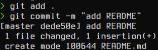
Ahora vamos usar el Push para que se suba al git de la organización.
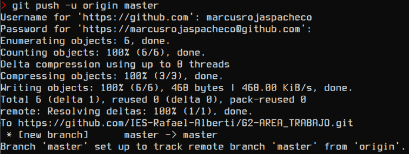
### CREAR EL GITIGNORE
Ahora Vamos a crear el fichero **.gitignore** y vamos especificar que ni añada archivos con la extensión **.log**.

Ahora añadimos fichero creado anteriormente.
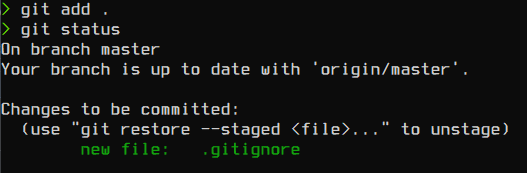
y una vez añadido vamos hacer un **push** en el repositorio.
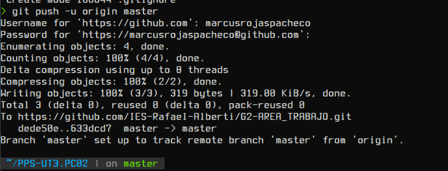
### CREAMOS UNA RAMA NUEVA
Ahora vamos usar una rama de trabajo para que se pueda cambiar y no se usa la **main** para los cambios y no afecte cualquier cambio que se haga en esa rama al **main** si no fue aceptada el cambio previamente.
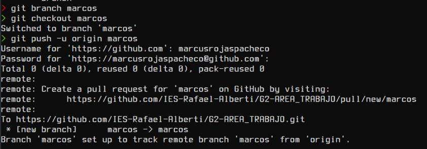
### CONFIGURAR EL GPG
Ahora vamos a configurar el **GPG** para poder tener una firma y se pueda verificar el commit que se haga.
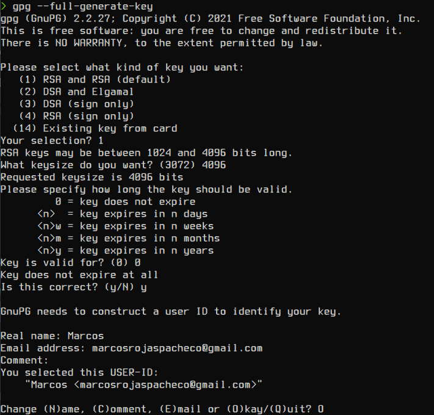
Ahora vamos a poner que clave o frase vamos usar de forma secreta.
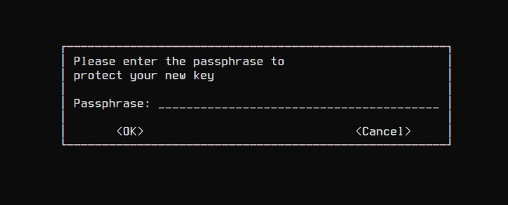
Se terminara el proceso pero aun falta que termina de configurar en nuestra cuenta de **GitHub**
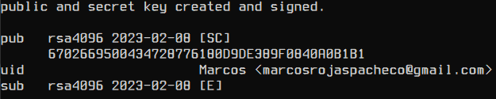
Ahora vamos a exportar la clave con **ID** de la clave **GPG** que usaremos.
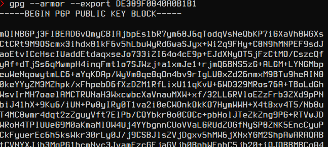
Ahora vamos a nuestro perfil de **GITHUB** y vamos a la zona de la **Configuración** y vamos a darle a **SSH Y GPG KEYS**, con lo cual copiamos el Export que nos dio anteriormente.
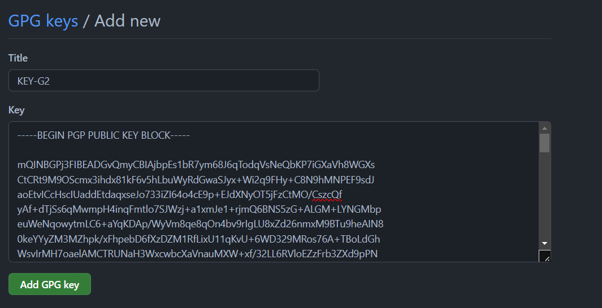
Ahora vamos añadir un documento con lo que nos pedira la firma con la frase anteriormente puesta como clave.
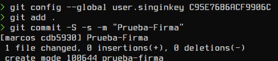
Ahora hacemos un **push** en el repositorio.
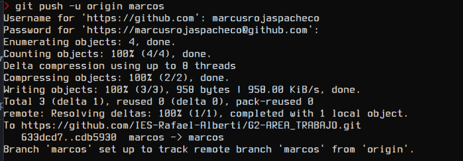
Y Comprobamos que fue quien firmo y se verifica quien hizo ese documento
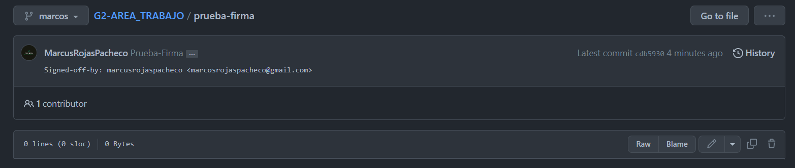
### GITLEAKS
Ahora vamos a usar **GitLeaks** para detectar y prevenir que contraseñas o claves.
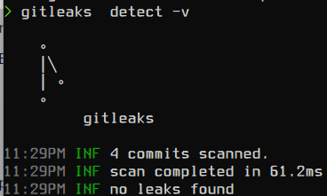
Ahora vamos a  crear un fichero llamado **.env** que tendra dentro una clave dentro del fichero.
#### NOTA EN ESTE PASO DA FALLO EL GITLEAKS
Como este paso me da fallo use otra herramienta que detecta que tenga clave secretas, es una herramienta parecida a **gitleaks**.
Para ello vamos a crear un fichero **.env** y lo añadimos y nos saltara los errores o hara un **skip** del fichero, pero aun sigue dando fallo al detecta las claves

